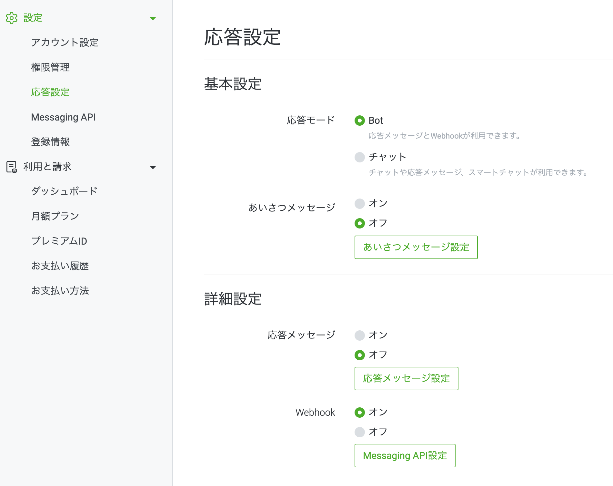

# LINE BOT チュートリアル
## 手順 
- LINE Developers
    1. `プロバイダー`を作成
    2. `チャンネル`を作成
        -  `Messaging API`を選択
    3. キーを取得
        - `チャンネル基本設定` > `チャネルシークレット`
        - `Messaging API 設定` > `チャネルアクセストークン`
        -  後ほど取得するGCP FunctionsのURLを設定
            - `Messaging API 設定` > `Webhook設定` > `Webhook URL`
                - `Webhook URL`の利用を許可する 
- LINE Official Account Manager
    - 
    
- GCP Funtions
    - GCPで`Cloud Functions API`を有効にする
    - 関数の作成
        - 環境 : 第一世代
        - [リージョン](https://cloud.google.com/about/locations?hl=ja#asia-pacific)
            - 東京（asia-northeast1）
            - 大阪（asia-northeast2）
        - トリガー HTTP
            - トリガーのタイプ : HTTP
            - `URL`の部分を前述のLINE Webhook URLに登録
        - 認証
            - 未承認の呼び出しを許可
        - HTTPSが必須 : チェックボックスを入れる
        - ランタイム環境変数
            - `LINE_CHANNEL_SECRET` : 上記のチャネルシークレット
            - `LINE_CHANNEL_ACCESS_TOKEN`: 上記のチャネルアクセストークン
        - ランタイム : Python3.10
        - コードを追加し, デプロイ
        - エントリポイント
            - 今回の場合だと`main`
        - BOTを公開する場合
            - 公開する関数にチェックボックスを入れる > 権限 > メンバーを追加 > 新しいメンバー : allUsers > ロール : Cloud Functions 起動元 
                - [Firebase functionsで 403 error "Your client does not have permission to get URL /** from this server" となった場合の解決策](https://qiita.com/toshiaki_takase/items/ce65cd5582a80917b52f)

    - リッチメニューの操作
        - LINE Official Account Manager で行う

## 参考文献
- [Github, line-bot-sdk-python](https://github.com/line/line-bot-sdk-python)
- [Cloud Functions (Python3)入門用に LINE BOTを作ってみる](https://qiita.com/spre55/items/da2ded18ac4652abb936)